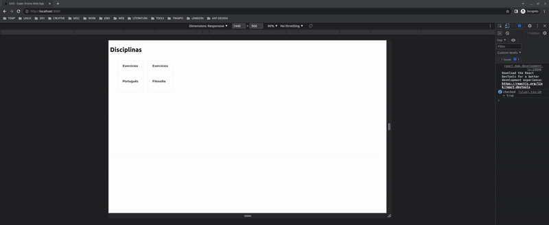

# :rocket: EAD - Super Ensino

Aplicação Web...

<div align="center">
    
</div>

## :electric_plug: Instalação

__Dependências__:

* Node V18.12.1
* Yarn
* Mongo DB

Como instalar **Node.js**:   

__1.__ Via **NVM** - Node Version Manager, consulte o [repositório](https://github.com/nvm-sh/nvm)   
__2.__ Via instalador (executável), consulte a [documentação](https://nodejs.org/en/download)

Como instalar **Yarn**: Consulte a [documentação](https://classic.yarnpkg.com/lang/en/docs/install/#debian-stable)
Como instalar **Mongo DB**: Consulte a [documentação](https://www.mongodb.com/docs/manual/installation/)

### Back-end

> **Nota**: 
Certifique-se de estar na raiz do diretório **:open_file_folder: back-end/**

__1. Habilite arquivos de configuração para variáveis de ambiente__

```
cp .env.sample .env
```
> __Nota__:
Caso seu Shell não entenda o comando `cp`, faça a cópia manualmente.

__2. Importe a base de dados NoSQL__

```
mongoimport --db super-ensino --collection exercicios --file ./src/db.json
```

__3. Instale as dependências__

```
yarn install
```
__3. Rode aplicação__

```
yarn dev
```
__4. Acesse API__

__Base URL__: [http://localhost:8000/api](http://localhost:8000)   

__Endpoints__:
* :arrow_right: GET /exercicios
